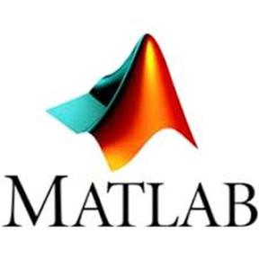

# Hi there &nbsp; 

 I'm Anant, welcome to my Github Profile!  

### 😛 **About me**

Experienced Data Scientist with a passion for exploring the potential of Language Models (LLMs) and Vision Transformers (ViTs). As a recent graduate from NYU, I am eager to contribute my expertise in a dynamic and collaborative work environment, where I can tackle challenging tasks head-on. I bring a wealth of skills to leverage in delivering impactful solutions. 

|- 💼 Deep Learning Engineer  - 🎾 Like to play Badminton  - 🐹 Pet Lover  - 💬 Ask me about anything [here](https://github.com/95anantsingh/95anantsingh/issues)|
<a class="badge-base__link LI-simple-link" href="https://www.linkedin.com/in/95anantsingh?trk=profile-badge">Anant Singh</a>
 |
| ------------- | ------------- |
              
 
<!-- 
  
|
 -->
 

|  |  |
| ------------- | ------------- |
 

### 🔧 Working with

&nbsp;&nbsp;&nbsp;&nbsp;
&nbsp;&nbsp;
&nbsp;&nbsp;
&nbsp;&nbsp;
&nbsp;&nbsp;
&nbsp;&nbsp;
&nbsp;&nbsp;
&nbsp;&nbsp;
&nbsp;&nbsp;
&nbsp;&nbsp;
&nbsp;&nbsp;
&nbsp;&nbsp;

 

<!-- ### 📚 Top Repositories

  -->

<!--  
 
### 📝 My Latest Medium Blog Post

  -->

<!-- 
- 
-    

 
-->

### 📮 Get In Touch!
📧 [anant.singh@nyu.edu](mailto:anant.singh@nyu.edu)
<!--  -->
<!--  -->

