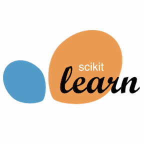

# Hi there &nbsp; 

 I'm Anant, welcome to my Github Profile!  

### 😛 **About me**

Driven and innovative Data Scientist specializing in Language Models (LLMs) and advancing NLP systems. As part of Apple’s DocAI team, I focus on optimizing and scaling NLP technologies to deliver next-generation solutions. With a passion for turning complex data into actionable insights, I thrive in fast-paced, collaborative environments, consistently pushing the boundaries of what’s possible in AI and machine learning. 

- 💼 Deep Learning Engineer
- 🎾 Like to play Tennis
- 🐹 Pet Lover 
- 💬 Have Questions? [Raise here](https://github.com/95anantsingh/95anantsingh/issues)

 

<table>
 <tr>
  <td>
   
  </td>
  <td rowspan=3>
   
  </td>
 </tr>
 <tr>
 <tr style="background-color: transparent !important;">
  <td>
   
  </td>
 </tr>
</table>

 

<!--

### 🔧 Working with

&nbsp;&nbsp;&nbsp;&nbsp;
&nbsp;&nbsp;
&nbsp;&nbsp;
&nbsp;&nbsp;
&nbsp;&nbsp;
&nbsp;&nbsp;
&nbsp;&nbsp;
&nbsp;&nbsp;
&nbsp;&nbsp;
&nbsp;&nbsp;
&nbsp;&nbsp;
&nbsp;&nbsp;

  -->

<!-- ### 📚 Top Repositories

  -->

<!-- 
 
### 📝 My Latest Medium Blog Post

  -->

<!-- 
- 
-    

 
-->

### 📮 Get In Touch!
📧 [anant.singh@nyu.edu](mailto:anant.singh@nyu.edu)
<!--  -->
<!--  -->

